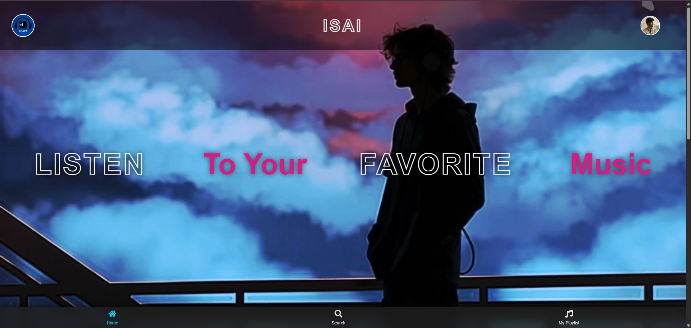
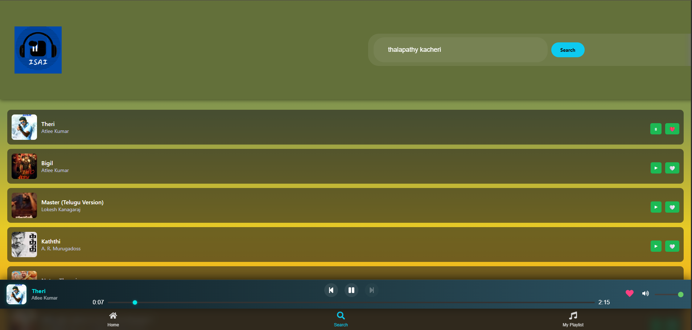
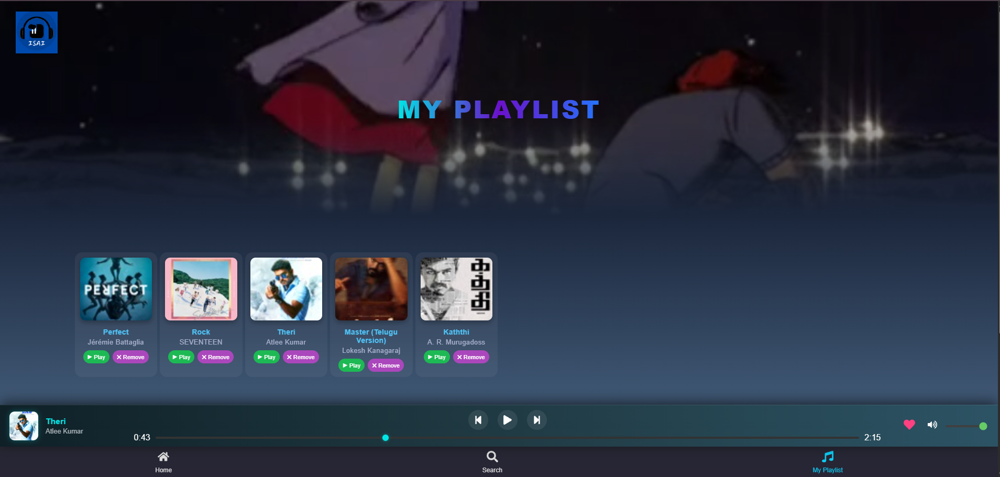

# 🎧 ISAI Music Playlist Manager

A modern and responsive **Music Playlist Web App** built with React that allows users to search, play, and manage their favorite songs — all in one place.  
This project provides a smooth, music-streaming-like interface with playlist management, playback controls, and search functionality powered by the **iTunes Public API**.

🎵 **Live Demo:** [https://aldarin25.github.io/ISAI-MUSIC-PAYER-/](https://aldarin25.github.io/ISAI-MUSIC-PAYER-/)

---

## 🚀 Features

- 🎵 **Stream Songs Instantly** – Listen to 30-second song previews from the iTunes API.  
- 🔍 **Smart Search** – Search by song name, artist, or album and get instant results.  
- ❤️ **Add to Playlist** – Add or remove songs from your personal playlist (stored locally).  
- 🎛 **Mini Music Player** – Includes play/pause, next/previous, seek, and volume control.  
- 📱 **Responsive UI** – Works perfectly across desktop and mobile devices.  
- 🌈 **Stylish Interface** – Modern glassmorphic layout with animated background videos.  
- 💾 **Persistent Storage** – Playlist data saved using `localStorage`.  
- 🌐 **Deployed on GitHub Pages** – Accessible publicly via live demo link.

---

## 🧠 Tech Stack

| Category | Technology |
|-----------|-------------|
| **Frontend** | React.js (v18) |
| **Routing** | React Router DOM (v6) |
| **Styling** | CSS3 (custom styles, responsive design) |
| **Icons** | React Icons |
| **API** | iTunes Search API |
| **State Management** | React Context API |
| **Deployment** | GitHub Pages (`gh-pages` npm package) |

---

## 🧩 Folder Structure

music-playlist-manager/
└── client/
├── public/
│ ├── index.html
│ └── manifest.json
├── src/
│ ├── App.js
│ ├── index.js
│ ├── styles.css
│ ├── assets/
│ │ ├── background.mp4
│ │ ├── bg.mp4
│ │ ├── logo.png
│ │ └── profile.jpg
│ ├── components/
│ │ ├── AudioPlayer.jsx
│ │ ├── BottomNav.jsx
│ │ ├── MiniPlayer.jsx
│ │ ├── SongCard.jsx
│ │ ├── Yard.jsx
│ │ └── Footer.jsx
│ ├── context/
│ │ └── PlayerContext.js
│ ├── pages/
│ │ ├── Search.js
│ │ ├── MyPlaylist.js
│ │ └── HomePage.js
│ └── index.css
└── package.json

---

## 🔗 API Details

This project uses the **iTunes Search API** to fetch and play song previews.

**Base Endpoint:**
**Example Request:**
https://itunes.apple.com/search?term=arijit+singh&entity=song&limit=20

**Returned Data Includes:**
- `trackId`
- `trackName`
- `artistName`
- `artworkUrl100`
- `previewUrl`

---

## ⚙️ How It Works

### 🎧 1. Search Songs
Users can search by keyword (artist/song/album).  
The app fetches results from the iTunes API and displays them as interactive cards.

### 🎶 2. Play Music
Click on a song card to start playback in the **Mini Player**, with:
- Play / Pause  
- Next / Previous  
- Seek Bar  
- Volume Control  

### ❤️ 3. Manage Playlist
Users can:
- Add favorite songs to their playlist  
- Remove them anytime  
- Data is stored in **localStorage**, so playlists stay even after reloads.

### 🏠 4. Routing
Implemented via **HashRouter** for smooth navigation on GitHub Pages.

| Path | Page |
|------|------|
| `/` | Home (Yard.jsx) |
| `/search` | Search songs |
| `/playlist` | My Playlist |

---
## 📸 Screenshots

### 🏠 Homepage

### 🔍 Search Page

### ❤️ My Playlist

---

💡 Future Enhancements

🎙 Integrate with Spotify API for full-length streaming

🧑‍💻 User authentication & personalized playlists

📊 Show most played & trending songs

🌙 Light/Dark mode toggle

☁ Cloud sync via Firebase

---

🧑‍💻 Author

Aldarin Jino
💼 Passionate about React, IoT, and Creative UI Projects.
🔗 LinkedIn Profile (https://www.linkedin.com/in/aldarin-jino-97265023a/?originalSubdomain=in)

🌐 Portfolio (https://aldarin25.github.io/Portfolio/)
